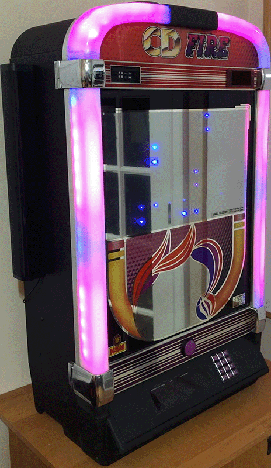

A daemon (macOS or Linux) for running my home brew jukebox project, written in Swift using [Flynn](https://github.com/KittyMac/flynn), [PortAudio](http://www.portaudio.com), [BlueSocket](https://github.com/IBM-Swift/BlueSocket) and [FadeCandy](https://github.com/scanlime/fadecandy).  


This jukebox works by passing through audio from any player (in this case, an Echo Dot) to the speakers attached to the audio output of the SoC.  The code then monitors this audio streams and animates the connected RGB lighting in response to the music.

### Hardware

[Nvidia Jeton Nano](https://www.nvidia.com/en-us/autonomous-machines/embedded-systems/jetson-nano/)  
[Amazon Echo Dot](https://www.amazon.com/gp/product/B07FZ8S74R/ref=ppx_yo_dt_b_search_asin_title?ie=UTF8&psc=1)  
[FadeCandy USB Driver](https://www.amazon.com/gp/product/B00JHJJF9W/ref=ppx_yo_dt_b_search_asin_title?ie=UTF8&psc=1)  
[RGB LED Light Strips](https://www.amazon.com/gp/product/B00ZHB9M6A/ref=ppx_yo_dt_b_search_asin_title?ie=UTF8&psc=1)  


### Software

This graph represents the major parts, **each part executes concurrently** to all other parts:


Jukebox uses Flynn, which is an Actor-Model framework for fast, easy and safe concurrency in Swift.  An Actor is Swift class which executes concurrently to everything else.  There are three actors:

1. **Audio** - uses port audio to passthrough audio input to audio output. Calculates audio statistics which are used by the other actors
2. **State** - tells the Lights actor when to change visuals (such as when one song ends and another begins), dimming the lights at night, and turning the lights off completely when inactive
3. **Lights** - utilizes a simple particle system to allow modular light visualizations, communicates with the FadeCandey server to provide light animations

If you are unfamiliar with Flynn, this level of concurrecy may seem unnecessarily complicated.  However Flynn makes conccurency safe and easy.  For example:


The switchVisuals() method is called by the State actor when it wants the Lights actor to use different visuals for the RGB lighting.  The ```beSetVisual()``` call is a **behavior** (denoted by it starting with "be").  All behaviors execute asynchronously.  In the lights actor, the behavior call looks like this:


From the State actor's perspective, ```beSetVisual()``` will execute asynchronously. From the Light actor's perspective, ```beSetVisual()``` will execute synchronously.  You can only communicate with actor's using behaviors, which means it is impossible for well-written code to accidentally execute on the actor's data structures on two different threads, eliminating all possible race conditions.